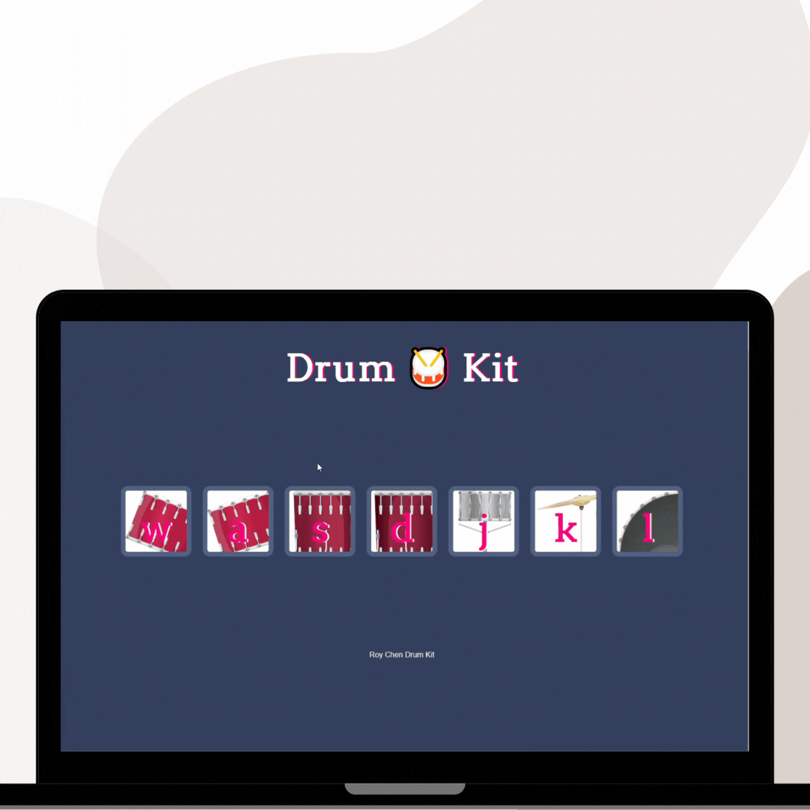

# 🥁 Awesome Drum Kit Website

This is a simple and interactive drum kit website created using HTML, CSS, and JavaScript. It allows users to play different drum sounds by clicking on the corresponding drum pads or using keyboard keys.


<p> </p>


## Features

- **Interactive Drum Pads:** Click on the drum pads to play different sounds.
- **Keyboard Support:** Press the corresponding keyboard keys to play the sounds.
- **Responsive Design:** The website is designed to work well on both desktop and mobile devices.

## Technologies Used

- HTML
- CSS
- JavaScript


## Render link to the drum kit

https://drum-kit-website.onrender.com/

## Usage

1. Clone the repository:

```bash
git clone https://github.com/Roychen651/Drum-Kit-JS-Project.git

